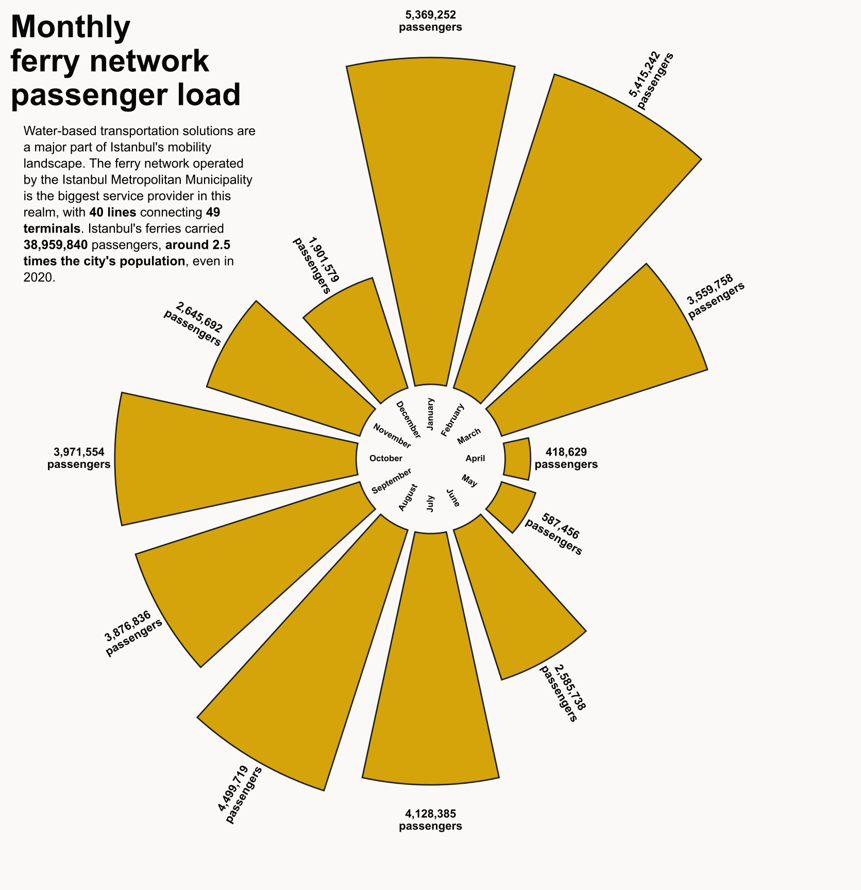
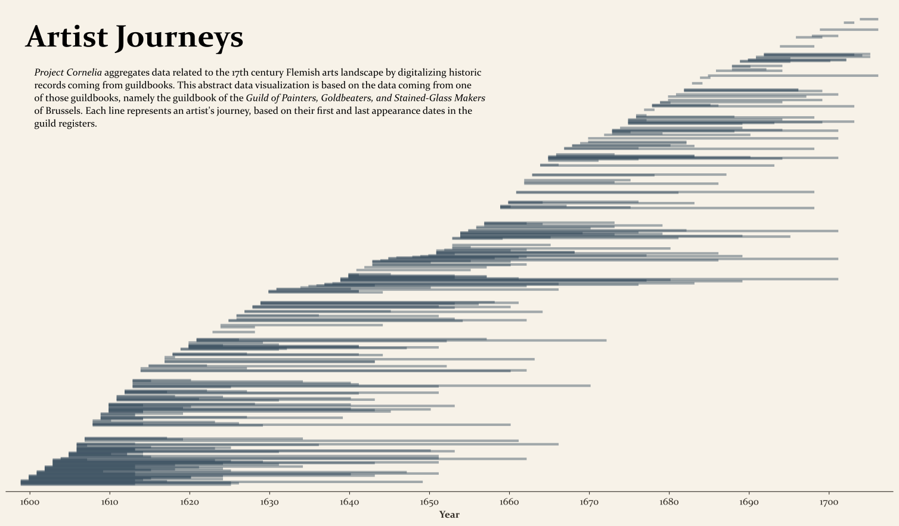
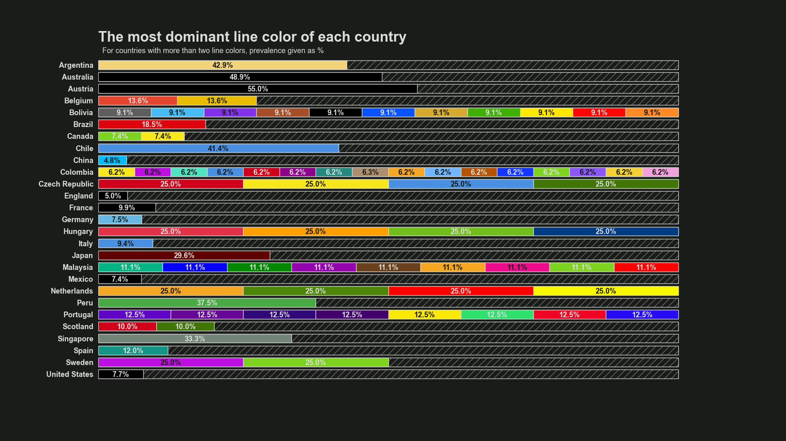
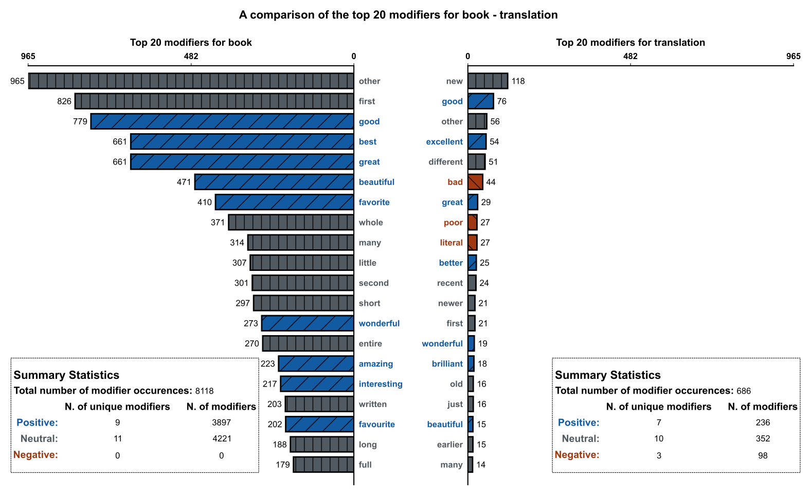

# Selected works

Below is a chronologically descending list of some of my data visualizations that I've deemed worthy of sharing.

***

- **Date**: 29-01-2022
- **Type**: Static, 2D
- **Taken from**: Assignment [(Analyzing Istanbul's ferry network)](https://github.com/ejgenc/data-analysis_istanbul-ferries))
- **Context**: The radial bar chart above displays the total passenger load of Istanbul's ferry network in 2020, sliced at the monthly level. Although not as visually accurate as a normal bar chart, this radial bar chart suits the cyclical nature of the months of a year well.
- **Tools used**: Python, Matplotlib, Inkscape

***

- **Date**: 25-01-2022
- **Type**: Static, 2D
- **Taken from**: Assignment [(Analyzing the Cornelia dataset)](https://github.com/ejgenc/data-analysis_cornelia)
- **Context**: This abstract 2D line chart is taken from an assignment completed for the MSc Digital Humanities programme offered by KU Leuven. The line chart plots the "journey" of the artists that appear in the guildbook of the Guild of Painters, Goldbeaters, and Stained-Glass Makers of Brussels. Each line represents an artist's journey. The ends of the lines fall on the first and the last recorded appearance year of the artist in the guildbook. The line length encodes journey length, as calculated by the time between last appearance and first appearance. The lines are ordered on the Y-axis in a chronologically ascending manner. The X-axis reflects the real entry dates of the guildbook entries. The lines are plotted with a level of transparency on purpose: the dates on which many journeys overlap appear more salient.
- **Tools used**: Python, Matplotlib, Inkscape

***

- **Date**: 02-01-2022
- **Type**: Dynamic, 3D
- **Taken from**: Assignment [(Analyzing metro lines around the world)](https://github.com/ejgenc/data-analysis_city-lines)
- **Context**: This 3D rotating scatterplot is taken from an assignment completed for the MSc Digital Humanities programme offered by KU Leuven. The visualization plots all the metro line colors in the dataset of interest, with added emphasis on the "average" color and outlier colors.
- **Tools used**: Python, Matplotlib

***

- **Date**: 02-01-2022
- **Type**: Static, 2D
- **Taken from**: Assignment [(Analyzing metro lines around the world)](https://github.com/ejgenc/data-analysis_city-lines)
- **Context**: This horizontally-oriented, stylized 2D stacked bar chart is taken from an assignment completed for the MSc Digital Humanities programme offered by KU Leuven. The bar chart shows the most dominant line color(s) and the ratio by which they are the most dominant for each country that was represented in the dataset.
- **Tools used**: Python, Matplotlib

***

- **Date**: 09-06-2021
- **Type**: Static, 2D
- **Taken from**: Bachelor's paper [(Seeking traces of the translator's invisibility)](https://github.com/ejgenc/data-analysis_goodreads-translation-reviews)
- **Context**: This dual-axis horizontal bar chart is taken from my Bachelor's graduation paper. In this figure the top twenty "modifiers" (adjectives) for the words "book" and "translation" are plotted along with their total occurence count and their emotional valence.
- **Tools used**: Python, Matplotlib, Inkscape

***

- **Date**: 19-11-2020
- **Type**: Static, 2D
- **Taken from**: Personal project [(A tribute to my wrongness)](https://github.com/ejgenc/data-analysis_istanbul-health-tourism)
- **Context**: This abstract map is taken from a personal data storytelling project I undertook in 2020. It was envisioned as a way to visually confirm that every AirBnB rental (blue dot) is properly matched with the nearest health tourism-related clinic (orange triangle).
- **Tools used**: Python, Matplotlib, Inkscape

***
